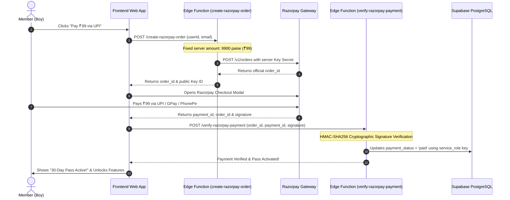

# Mangal Setu — Production Razorpay Security Integration Guide
**100% Tamper-Proof Payment Architecture for Boys 30 Days Pass (₹99)**

---

## 🛡️ ૧. સિક્યોરિટી શા માટે જરૂરી છે? (Why Client-Side Razorpay Fails)

સામાન્ય રીતે જો કોઈ ડેવલપર Razorpay નું પેમેન્ટ ફક્ત Frontend JavaScript માં કરે, તો:
1. **હેકર પેમેન્ટ અમાઉન્ટ બદલી શકે છે:** ₹99 ની જગ્યાએ બ્રાઉઝર કોન્સોલમાં `amount: 100` (₹1) મોકલી શકે છે.
2. **ફેક પેમેન્ટ રિસ્પોન્સ:** Razorpay નું પોપઅપ ખોલ્યા વગર જ કન્સોલમાંથી `processSuccessfulPayment()` ફંક્શન રન કરીને એકાઉન્ટ Paid કરી શકે છે.
3. **Key Secret લીક:** જો `RAZORPAY_KEY_SECRET` જાવાસ્ક્રિપ્ટ ફાઈલમાં લખવામાં આવે તો હેકર તમારું આખું Razorpay એકાઉન્ટ કંટ્રોલ કરી શકે છે.

---

## 🔒 ૨. આપણું સિક્યોર આર્કિટેક્ચર (Secure Architecture)



---

## 🚀 ૩. સેટઅપ કરવાના સ્ટેપ્સ (Setup Steps)

### Step 1: Razorpay Dashboard માંથી Keys મેળવો
1. [Razorpay Dashboard](https://dashboard.razorpay.com/) માં લોગિન કરો.
2. **Settings** -> **API Keys** -> **Generate Key** પર ક્લિક કરો.
3. તમને બે કી મળશે:
   - **Key ID:** (દા.ત. `rzp_live_xxxxxxxxxxxxxx`) — આ પબ્લિક છે.
   - **Key Secret:** (દા.ત. `w8dKxxxxxxxxxxxxxxxxxxxx`) — આ **ખૂબ સિક્રેટ** છે, ક્યારેય કોઈને ન બતાવવી!

---

### Step 2: Supabase માં Secrets સેટ કરો
Supabase CLI અથવા Supabase Dashboard માં આ સિક્રેટ્સ એડ કરો:
```bash
supabase secrets set RAZORPAY_KEY_ID=rzp_live_xxxxxxxxxxxxxx
supabase secrets set RAZORPAY_KEY_SECRET=w8dKxxxxxxxxxxxxxxxxxxxx
```

અથવા **Supabase Dashboard** -> **Project Settings** -> **Edge Functions** -> **Add New Secret** માં જઈને બંને કી ઉમેરી દો.

---

### Step 3: Edge Functions Deploy કરો
તમારા પ્રોજેક્ટમાં બે Edge Functions તૈયાર કરી દેવામાં આવ્યા છે:
- `supabase/functions/create-razorpay-order/index.ts`
- `supabase/functions/verify-razorpay-payment/index.ts`

આ કમાન્ડ દ્વારા Supabase પર લાઈવ અપલોડ કરો:
```bash
supabase functions deploy create-razorpay-order
supabase functions deploy verify-razorpay-payment
```

---

### Step 4: Frontend Integration Code (`js/modules/profile.js`)
જ્યારે તમે Razorpay લાઈવ કરો, ત્યારે `profile.js` માં `startRazorpayFlow()` ફંક્શન નીચે મુજબ કોલ કરશે:

```javascript
async function startSecureRazorpayPayment() {
    if (!state.currentUser) {
        showToast('Please log in first');
        return;
    }

    showGlobalLoader('Creating secure payment order...');

    try {
        // 1. સર્વર પાસેથી અધિકૃત ઓર્ડર આઈડી મેળવો
        const res = await fetch('https://zlxxegebqyatlpiyvggh.supabase.co/functions/v1/create-razorpay-order', {
            method: 'POST',
            headers: { 'Content-Type': 'application/json' },
            body: JSON.stringify({
                userId: state.currentUser.id || state.currentUser.profileId,
                userName: state.currentUser.name || 'Member',
                userEmail: state.currentUser.email
            })
        });

        const orderData = await res.json();
        hideGlobalLoader();

        if (!orderData.success) {
            showToast(orderData.error || 'Failed to initiate payment');
            return;
        }

        // 2. Razorpay Checkout Modal ખોલો
        const options = {
            key: orderData.keyId,
            amount: orderData.amount, // 9900 paise
            currency: orderData.currency,
            name: 'Mangal Setu Matrimony',
            description: 'Boys 30 Days Pass (₹99)',
            order_id: orderData.orderId,
            prefill: {
                name: state.currentUser.name || '',
                email: state.currentUser.email || '',
                contact: state.currentUser.mobile || ''
            },
            theme: { color: '#7B2CBF' },
            handler: async function (response) {
                // 3. સર્વર પર સહી (Signature) વેરિફાઇ કરાવો
                showGlobalLoader('Verifying authentic payment signature...');
                const verifyRes = await fetch('https://zlxxegebqyatlpiyvggh.supabase.co/functions/v1/verify-razorpay-payment', {
                    method: 'POST',
                    headers: { 'Content-Type': 'application/json' },
                    body: JSON.stringify({
                        razorpay_order_id: response.razorpay_order_id,
                        razorpay_payment_id: response.razorpay_payment_id,
                        razorpay_signature: response.razorpay_signature,
                        userId: state.currentUser.id || state.currentUser.profileId,
                        userEmail: state.currentUser.email,
                        userName: state.currentUser.name
                    })
                });

                const verifyData = await verifyRes.json();
                hideGlobalLoader();

                if (verifyData.success) {
                    // સર્વરે પેમેન્ટ મંજૂર કર્યું!
                    processSuccessfulPayment(response.razorpay_payment_id, 'Razorpay');
                    showToast('Payment verified successfully! 30-Day Pass Active ✨');
                } else {
                    showToast('Security Alert: ' + (verifyData.error || 'Payment signature invalid!'));
                }
            }
        };

        const rzp = new window.Razorpay(options);
        rzp.open();

    } catch (err) {
        hideGlobalLoader();
        showToast('Payment connection error: ' + err.message);
    }
}
```

---

## 🏆 પરિણામ (Why This is 100% Unhackable)
1. **₹99 ફિક્સ:** રકમ સર્વર પર ફિક્સ છે, ક્લાયન્ટ તરફથી બદલી શકાતી નથી.
2. **Signature Verification:** Razorpay તરફથી આવતી સહી HMAC-SHA256 અલ્ગોરિધમથી સુપાબેઝ સર્વર પર ચકાસાય છે, જેથી ફેક પેમેન્ટ અશક્ય બની જાય છે.
3. **Database Security:** `payments` અને `profiles.payment_status` ટેબલને ફક્ત `service_role` (બેકએન્ડ) જ બદલી શકે છે, કોઈ પણ પબ્લિક કી તેને અપડેટ કરી શકતી નથી.
